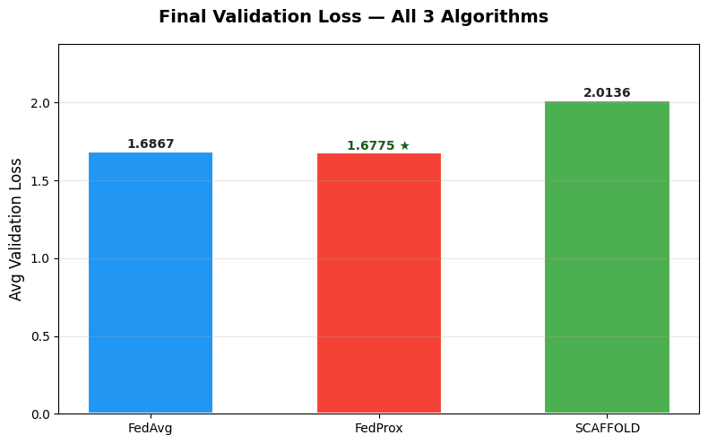

# Federated Fine-Tuning of Gemma-2B with LoRA (4-bit)

Simulates a federated learning pipeline on a single machine — 3 client orgs + 1 aggregator — fine-tuning **Gemma-2B** (4-bit, LoRA r=3) on the [MedQuAD](https://www.kaggle.com/datasets/pythonafroz/medquad-medical-question-answer-for-ai-research) medical Q&A dataset, split into equal **IID** shards.

```
Org A shard   Org B shard   Org C shard
     \            |             /
      local LoRA fine-tune (each org)
                  |
        FedAvg aggregation -> Global Model v1
                  |
     (optional centralized fine-tune) -> v1.5
                  |
        repeat rounds -> Global Model v2
                  |
     each org personalizes locally -> Personalized Models
```

## Notebooks

| Notebook | Description |
|---|---|
| `federated_gemma2b_iid.ipynb` | Base pipeline: FedAvg over LoRA adapters, IID split, global + personalized models |
| `algo_comparison.ipynb` | Same dataset/model/split, compares **FedAvg vs FedProx vs SCAFFOLD** aggregation strategies |

## Stack

- **Base model:** `google/gemma-2b`, 4-bit quantized (`bitsandbytes`)
- **Fine-tuning:** LoRA (rank = 3) via `peft`
- **Federated logic:** manual implementation, no external FL framework
- **Data:** single Kaggle dataset, split into 3 equal IID shards

## Algorithm Comparison

`algo_comparison.ipynb` benchmarks three federated aggregation strategies on the same IID shards:

- **FedAvg** — plain weighted averaging of local LoRA updates
- **FedProx** — adds a proximal term to keep local updates close to the global model
- **SCAFFOLD** — uses control variates to correct client drift




## Requirements

- Python 3.10+, single 16GB GPU (Colab T4/L4, Kaggle P100/T4) — CPU works but is slow
- `transformers`, `peft`, `bitsandbytes`, `torch`, `datasets`

## Quick Start

```bash
pip install transformers peft bitsandbytes torch datasets
jupyter notebook federated_gemma2b_iid.ipynb
```

## License

MIT
